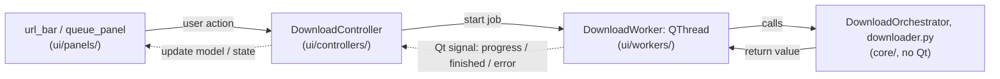

# BananaFlow — Project Structure

A developer-oriented map of how the code is laid out and wired. For
features, install, and usage see [`README.md`](README.md) and the
[User Manual](docs/user-guide/user-manual.md).

## Layer diagram

```
┌─────────────────────────────────────────────────────────────────┐
│                     UI layer (PySide6 / Qt6)                     │
│  app_window.py · panels/ · components/ · dialogs/ · models/     │
├─────────────────────────────────────────────────────────────────┤
│                    Controllers  (ui/controllers/)                │
│  business logic between the window and the core engines          │
├─────────────────────────────────────────────────────────────────┤
│                    Worker threads  (ui/workers/)                 │
│  QThread bridges: run core code off the UI thread, emit signals  │
├─────────────────────────────────────────────────────────────────┤
│                       Core layer  (core/)                        │
│  downloader · playlist_parser · scraper · search_engine · …      │
├─────────────────────────────────────────────────────────────────┤
│              Utils & config  (utils/ · config.py · …)            │
└─────────────────────────────────────────────────────────────────┘
```

**Layering rule:** `core/` and `utils/` import **no Qt/PySide6** and run
headlessly — the CLI (`cli.py`) drives the exact same core through the same
`OrchestratorCallbacks` protocol the Qt worker implements. The one
deliberate exception is `ui.i18n`: it is a plain-Python translation lookup
(all Qt imports are deferred), and two backend modules
(`core/downloader.py`, `utils/cookie_validator.py`) import its `t()` helper
so the user-facing text they generate is localized in one place. Nothing in
`core/` or `utils/` imports a Qt symbol.

## Worker / controller / core data flow

Every long-running action follows the same one-way shape: a controller
starts a `QThread` worker, the worker calls into `core/`, and results come
back **only** as Qt signals — never a direct call into UI widgets from the
worker thread. The download flow is a concrete example of the pattern:



The same shape repeats for search (`search_panel` →
`SearchController` → `SearchWorker` → `search_engine.py`), metadata
editing (`metadata_editor_panel` → `MetadataController` →
one of `ui/workers/metadata_worker.py`'s `QThread` workers
(`MetadataScanWorker`, `MetadataApplyWorker`, …) → `metadata_processor.py`),
and channel scraping (`ChannelFlowController` → `ChannelScrapeWorker` →
`channel_tab_discoverer.py`/`scraper.py`). `cli.py` skips the
controller/worker/signal layers entirely and drives `core/` directly
through the same `OrchestratorCallbacks` protocol the workers implement —
see "Layering rule" above.

## Entry points

| File | Role |
|------|------|
| `main.py` | GUI entry point. Builds `QApplication`, loads `AppConfig`, activates any bundled downloader components, applies language + theme, shows `AppWindow`, runs a startup preflight, enters the Qt event loop. |
| `cli.py` | Headless CLI (`bananaflow-cli`). Same core engine, no Qt. Adds `--list`, `--version`, `--doctor`. |
| `config.py` | `AppConfig` — typed, persistent user preferences in `<app-data>/config.json`; atomic writes. |
| `config_migrate.py` | Forward-only config schema migrations (see `CURRENT_VERSION` there for the current schema). |
| `error_handler.py` | Classifies raw exceptions into localized `ErrorInfo`; startup `run_preflight()` (FFmpeg / network / output dir / cookies / Playwright). |
| `version.py` | Single source of truth for version + product/publisher metadata (SemVer core, pre-release suffix, PEP 440 form and the Windows version tuple all derive from here). |

## `core/` — backend (no Qt)

Download + resolution: `downloader.py`, `download_orchestrator.py`
(thread-pool batch manager + history persistence), `playlist_parser.py`
(URL classifier + metadata extractor), `hls_downloader.py`,
`universal_extractor.py`, `listing_scraper.py`, `retry_policy.py`,
`youtube_reliability.py` (YouTube-only conservative serialization).

Scraping + search: `scraper.py` (Playwright scrapers for Spotify / YTM /
YouTube channels), `search_engine.py`, `channel_tab_discoverer.py`,
`duplicate_detector.py`, `spotify_match_scorer.py`.

Post-processing: `musicbrainz_enricher.py`, `lyrics_embedder.py`,
`replay_gain.py`, `thumbnail_cropper.py`, `metadata_processor.py` +
`metadata_models.py` (Tag Editor).

Data + services: `history_db.py` (SQLite + FTS5), `queue_persistence.py`,
`duplicate_checker.py`, `batch_importer.py`, `services.py`
(`ServiceContainer` DI), `offline_monitor.py`.

Reliability + updates: `youtube_doctor.py`, `warning_classifier.py`,
`runtime_components.py` (bundled PO Token Provider / JS runtime),
`update_checker.py` (GitHub releases), `component_updates.py` (PyPI),
`update_state.py`, `cookie_wizard.py`.

## `ui/` — frontend (PySide6 + QFluentWidgets)

- `app_window.py` — the mediator: owns panels + controllers, wires every
  signal, handles tray / drag-drop / accessibility / clipboard / close.
- `theme_manager.py` — dark/light themes, accent colour, and the
  high-contrast accessibility overlay.
- `i18n.py` — English/Hebrew translation tables + RTL coordination.
- `direction.py` — LTR/RTL helpers.
- `panels/` — full pages: `url_bar`, `options_bar`, `queue_panel`,
  `search_panel`, `history_panel`, `settings_panel`, `converter_panel`,
  `metadata_editor_panel`, `status_bar`.
- `components/` — leaf widgets: `track_card`, `search_result_card`,
  `history_row`, `offline_banner`.
- `dialogs/` — `styled_dialog` (theme/RTL-aware dialog toolkit),
  `update_prompt_dialog`, `youtube_doctor_dialog`, `cookie_auth_dialog`,
  `tab_select_dialog`, `conflict_resolution_dialog`,
  `duplicate_files_dialog`.
- `models/` — `metadata_table_model` (Qt model for the Tag Editor table).
- `controllers/` — `download_controller`, `fetch_controller`,
  `search_controller`, `metadata_controller`, `channel_flow_controller`.
- `workers/` — `download_worker`, `fetch_worker`, `search_worker`,
  `scraper_worker`, `channel_scrape_worker`, `thumbnail_worker`,
  `clipboard_worker`, `offline_monitor`, `update_worker`,
  `component_install_worker`, `duplicate_detector_worker`,
  `metadata_worker`.

## `utils/` — shared helpers (no Qt)

`yt_dlp_opts.py` (shared yt-dlp option builders + JS-runtime detection),
`spotify_resolver.py`, `ytm_scraper.py`, `paths.py` (single source of
truth for app-data locations — including the tag-backup and preset
helpers — plus bundled-FFmpeg discovery), `playwright_check.py`,
`cookie_validator.py`, `artwork_cleaner.py`, `metadata_cleaner.py`,
`url_cleaner.py`, `time_format.py`, `network_probe.py`, `logger.py`,
`logging_config.py`.

## `packaging/` and `scripts/` — build and release

- `packaging/bananaflow.spec` — PyInstaller one-folder build for both
  `bananaflow` (GUI) and `bananaflow-cli`; wraps the macOS build into
  `BananaFlow.app`.
- `packaging/bananaflow.iss` — Inno Setup installer definition.
- `packaging/bananaflow.ico` / `bananaflow.icns` / `installer/` — brand
  assets (provenance in `packaging/BRAND_ASSETS.md`).
- `packaging/generate_version_info.py` — Windows VS_VERSIONINFO block.
- `packaging/stage_pot_provider.py` + the `runtime/`,
  `pot-provider-backend/`, `yt-dlp-plugins/` staging slots (README-only
  in git; populated at build time).
- `scripts/build_windows.ps1` / `build_macos.sh` — full platform builds.
- `scripts/run_isolated_tests.py` — the supported test entry point.
- `scripts/generate_sbom.py`, `generate_constraints.py`,
  `fetch_deno_runtime.ps1`, `install_playwright.ps1`,
  `run_network_tests.py`, `run_local_av_scan.ps1`.

## `docs/` — documentation

- `docs/user-guide/` — the User Manual (EN), the Hebrew user guide, the
  Spotify proxy API notes and the YouTube Doctor QA checklist.
- `docs/architecture/` — design decisions and safety invariants
  (browser component decision, secure component updater, tag-editor
  undo/rollback guarantees, persistence migrations, tag-editor safety).
- `docs/legal/` — acceptable use, PO Token Provider distribution
  decision.
- `docs/release/RELEASING.md` — the release process.
- `docs/performance/` — package and runtime profiling notes.

## Key data types

| Type | Module | Purpose |
|------|--------|---------|
| `AppConfig` | `config.py` | Persistent user preferences |
| `TrackMeta` / `ParseResult` | `core/playlist_parser.py` | One track's metadata / a full parse result |
| `DownloadRequest` / `DownloadProgress` | `core/downloader.py` | One download job / a live progress snapshot |
| `SearchResult` | `core/search_engine.py` | One search result |
| `DownloadRecord` | `core/history_db.py` | One history row |
| `ErrorInfo` | `error_handler.py` | Classified, localizable error |
| `ReleaseInfo` / `ComponentUpdateReport` | `core/update_checker.py` / `core/component_updates.py` | App / component update results |
| `YoutubeDoctorReport` | `core/youtube_doctor.py` | Offline reliability diagnostics |

## Download concurrency

Downloads run **in parallel** through `DownloadOrchestrator`'s
`ThreadPoolExecutor` (`max_parallel_downloads`, 1–6). YouTube URLs are the
exception: conservative mode serializes them one-at-a-time with a cooldown
(`core/youtube_reliability.py`) regardless of the parallelism setting.
Cancellation is per-track (`threading.Event`) and batch-wide.

## Tests

`pytest` suite under `tests/`. The supported entry point is
`python scripts/run_isolated_tests.py`, which runs each test file in a
fresh process — the full suite in a single process can crash during
native Qt teardown on Windows. Qt-dependent tests skip gracefully when
PySide6 is unavailable; headless runs use `QT_QPA_PLATFORM=offscreen`.
